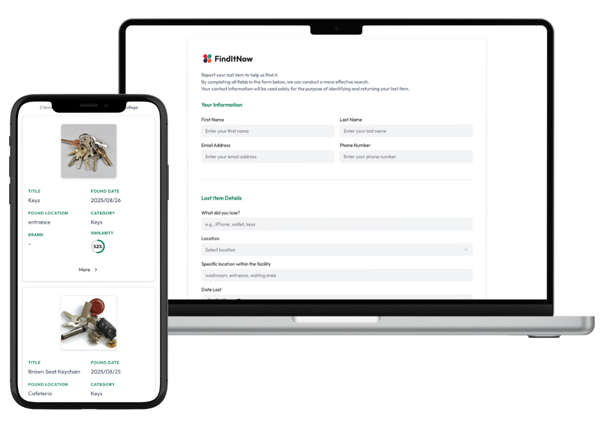

# FindItNow

An AI-powered lost-and-found platform that connects seekers with organizations, reduces stress, and saves time.

---

## 🎯 Overview

**The Problem:**  
- **For individuals:** Losing items is stressful and slow. Recovery chances are low, and traditional methods (social media, calls) are unreliable.  
- **For organizations:** Organizations spend too much time on manual logs, spreadsheets, or physical storage, causing confusion and wasted effort.

**Our Solution:**  
**FindItNow** connects seekers and organizations in a centralized platform.  
- **Seekers** can post lost items, get AI-powered matches, and securely connect with finders.  
- **Organizations** can manage found items digitally, streamline operations, and save staff time.

---

## ⚙️ How It Works

### 3 Simple Steps
1️⃣ **Post** – Report lost items or log found items.  
2️⃣ **AI Match** – Automatic matching based on item details.  
3️⃣ **Connect & Return** – Securely connect the right people and return items.

**Lost-and-found, simplified for everyone.**

 

---

## 💡 Key Features

- 🧠 AI-powered matching between lost & found items  
- 📬 Instant notifications  
- 🔐 Secure verification for ownership  
- 📊 Admin dashboard for easy management  
- 👥 Role-based access control  
- ✍️ Simple item logging and tracking

---

## 🛠️ Tech Stack

- **Frontend:** Next.js, TypeScript, Tailwind CSS, shadcn/ui
- **Backend:** Node.js, Supabase, Prisma 
- **Deployment:** Vercel  
- **Other Tools:** Open AI, Gemini, Resend, Firebase Storage

---

## 🚀 Live Demo

[https://finditnow-app.vercel.app/](https://finditnow-app.vercel.app/)

---

## 🪪 License

MIT License — see [LICENSE](./LICENSE) file.
